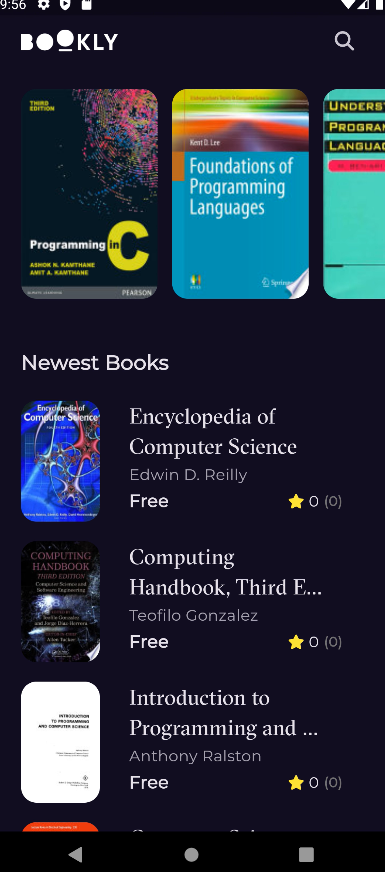
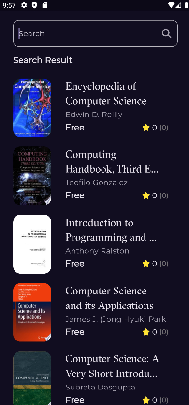

# 💻 Flutter Programming Books App

**Your Personal Programming Book Explorer & Preview App**

This Flutter app allows users to explore **free programming books** from the Google Books API, view book details, and read previews using external links.  
Built with **Clean Architecture** and **Cubit for state management**, the app delivers a smooth, modern, and responsive user experience.

---

## 📸 Screenshots & Demo Video

<p align="center">
  <!-- Screenshots -->
  
  
   
  
</p>

<p align="center">
  <!-- Clickable thumbnail to Google Drive video -->
   <a href="https://drive.google.com/file/d/1jNsca8tihGqDS-A8q6W6Ch5hNWj69oLf/view?usp=drive_link">
    
  </a>
</p>

<p align="center">
  Click the thumbnail above to watch the full demo video.
</p>

---

## ✨ Features

- 🎬 **Splash Screen with Animation**  
- 📖 **Home Screen** with two sections: *Programming Books* & *New Programming Books*  
- **Shimmer loading effect** while fetching data from API  
- **Search functionality** to find books by title or author  
- 📘 **Book Details Screen**  
  - Displays **book cover, title, author, rating**  
  - Shows **similar programming books**  
  - Allows **previewing books** using `launchUrl`  
- ⚡ Fast, responsive UI with **Clean Architecture** and **Cubit**  

---

## 🛠 Technologies Used

| Technology | Usage |
|------------|-------|
| Flutter | Cross-platform development |
| Cubit (Bloc) | State management |
| Clean Architecture | Modular & scalable project structure |
| Google Books API | Free programming book data |
| Shimmer | Loading placeholders |
| url_launcher | Open book previews in external browser |

---
## 📂 Project Structure

The project follows **Clean Architecture principles** to maintain a modular and scalable codebase.

```text
lib
 ┣ core
 ┃ ┣ errors                # Custom error handling classes
 ┃ ┣ models                # Shared models used across features
 ┃ ┣ use_cases             # Common or global use cases
 ┃ ┣ utils 
 ┃ │   ┗ functions         # Helper functions (API formatting, validators, etc.)             
 ┃ ┗ widgets               # Reusable widgets (Shimmer, Cards, Buttons)  
 ┣ features
 ┃ ┣ splash                # Splash screen & animation
 ┃ ┣ home                  # Home screen with sections & book details
 ┃ ┗ search                # Search functionality for programming books 
 ┣ main.dart               # App entry point
```

### Folder Descriptions

- **core/errors** → Contains error handling classes for API, network, or app exceptions  
- **core/models** → Shared models used across multiple features  
- **core/use_cases** → Global or common use cases (logic shared across features)  
- **core/utils/functions** → Helper functions like API formatting, validators, date formatting  
- **core/widgets** → Reusable widgets like Shimmer loaders, Book Cards, Buttons  
- **features/splash** → Splash screen with animations  
- **features/home** → Home screen with sections for programming books & book details  
- **features/search** → Handles searching books by title
- **main.dart** → App entry point

---

## 🚀 Getting Started

1️⃣ Clone the repository:

```bash
git clone https://github.com/Fatma-kabil/Bookly-App
```

2️⃣ Navigate to the project directory:

```bash
cd Bookly-App
```

3️⃣ Install dependencies:

```bash
flutter pub get
```

4️⃣ Run the app:

```bash
flutter run
```

---

## 🎯 Project Goals

- Explore **free programming books** from Google Books API  
- Display book details & similar recommendations  
- Implement **Clean Architecture** with **Cubit**  
- Enhance UX with Shimmer loading and animated splash  
- Enable previewing programming books using `launchUrl`  
